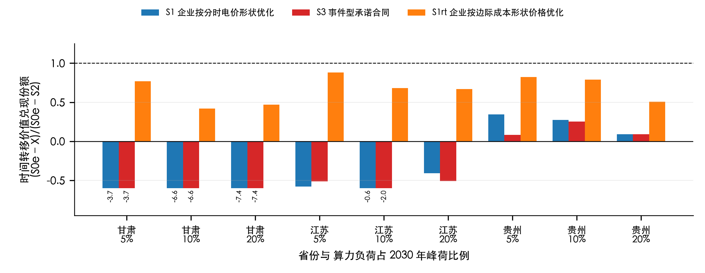
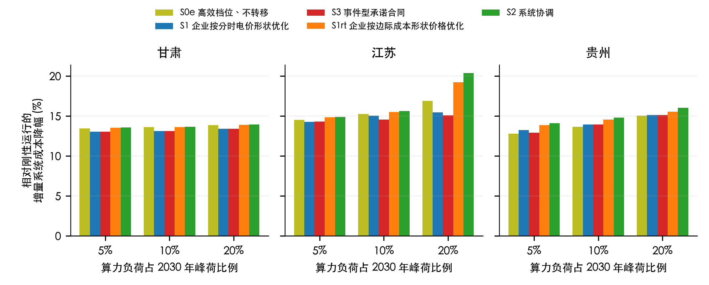
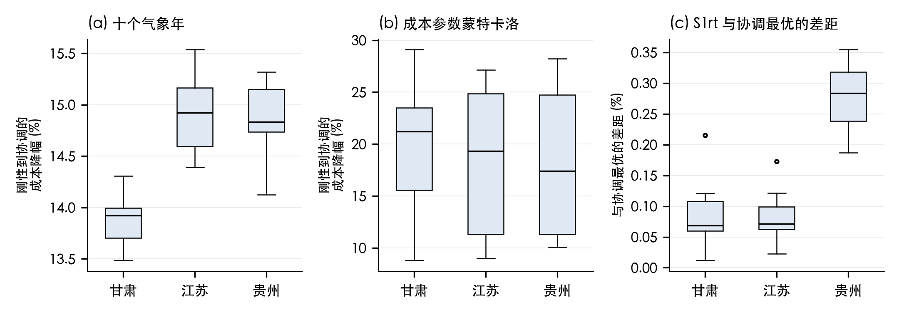

# 分时电价形状与算力负荷时间转移价值：面向中国省级电力系统的情景分析

**William Wei^1,2^，刘岚岚^2,3^**

（1. 利兹大学 计算学院，英国 利兹；2. 空间计算（福建）科技有限公司，福建 福州；3. 福建师范大学 公共管理学院，福建 福州）

**通信作者：** William Wei，qkfp0742@leeds.ac.uk

**摘要：** 人工智能（AI）算力负荷既可通过降低运行档位减少单位工作量的能耗，也可在时间上转移执行，两者对电力系统的价值来源不同。本文在同等计算工作量与同等供电可靠性条件下，将实测图形处理器（GPU）功率档位、生产集群作业轨迹、电力投资—运行联合规划模型与企业在电价和合同下的行为纳入同一框架，以甘肃、江苏、贵州三省 2030 年公开数据情景为对象，重点分析分时电价形状、事件型承诺合同与按系统边际成本形状定价三种信号对时间转移价值兑现的影响。结果表明：在孤岛情景下，系统协调相对刚性全速运行可降低算力负荷增量系统成本 13.6%～28.5%，其中高效档位不作任何转移即可获得绝大部分；时间转移的剩余价值仅为增量成本的 0.1%～4.4%，有省间交换时低于 0.4%，仅在容量紧缺时可避免吉瓦级燃气机组投资。企业按现行分时电价形状优化时，时间转移在 18 组孤岛设定中的 14 组产生负价值，原因是电价低谷时段与系统富余时段错位；叠加事件型承诺合同不能改善并暴露于基线操纵；按系统边际成本形状的逐时价格可在除 1 组以外的全部设定中回收转移价值，总成本与协调最优的差距不超过 2.6%。结论对中国省级分时电价与算力负荷需求响应机制设计具有直接含义：近期应优先释放高效档位价值，时间转移需要形状正确的价格而非叠加在现行电价上的合同。

**关键词：** 算力负荷；数据中心；需求响应；分时电价；负荷灵活性；电力系统规划；机制设计

## 0 引言

AI 算力是中国增长最快的新增电力负荷之一。国家算力枢纽布局[1]与绿电直连等政策把算力负荷视为可调度资源，现场实验也已证明 AI 集群可以调节功率[2]。但"可调"不等于"有价值"：算力负荷是否给电力系统带来价值，取决于任务能否在服务约束下完成、系统是否存在稀缺或富余时段，以及企业面对的价格信号是否使其愿意交付。已有研究分别讨论了数据中心时空转移的市场补偿[3-5]、灵活数据中心在容量规划中降低成本但可能增加排放[6]、中国"东数西算"的能耗与排放效应[7]、推理灵活性的容量充裕性价值[8]以及并网净收益检验[9-10]，多把灵活性视为单一量。然而实测 GPU 集群提供两类不同的杠杆：降低功率上限以减少单位工作量能耗（代价是运行时间延长），以及在时间上转移执行。两者的系统价值与企业兑现份额并不相同。

本文的贡献是在同一框架内分离这两类价值，并检验中国省级电力市场中三种价格信号对时间转移价值兑现的影响。本文与作者的英文稿[11]共享模型、数据以及甘肃、江苏、贵州三省六种情景（S0、S0e、S1、S3、S1rt、S2）与机制比较（分时电价、事件合同、连续价格）的核心数值结果，不涉及跨国/跨地区比较；本文在共享结果基础上新增第 3 节，将其转化为对中国省级分时电价与算力负荷需求响应机制设计的政策含义。全部结果为公开数据情景结果，证据层级与局限在第 1 节与第 4 节说明。

## 1 模型与情景

### 1.1 任务—功率模型

算力池 p 中的批次 j 具有到达时刻 r、期限 d 与以全速池小时计的工作量 w；小时 t、档位 m 的执行份额 y 满足池容量约束、窗口约束与工作量完成等式，不允许丢弃或推迟到时段之外；池功率为空闲功率加各档位增量功率的加权和。档位取自文献[2]公开的微调配置六档功率上限的实测功率与吞吐量，剔除实测功率低于节点空闲功率加 2 个百分点的档位后保留 5 档。节点空闲功率取 MLPerf Training v4.0 公开的 8×H100 节点交流功率日志[12]，三个基准的空闲与峰值之比为 35%～41%，基准情景取 41%。批次由商汤 Helios 集群轨迹[13]中已完成的 GPU 作业按提交小时抽样生成，保留 GPU 数与运行时长，总工作量按池利用率 70% 缩放；期限为运行时长加该作业自身观测排队等待乘以倍数（1 或 3）再加基础松弛（6 或 24 h）。三套公开生产轨迹（Helios[13]、阿里 PAI[14]、微软 Philly[15]）显示运行超过 24 h 的作业占 GPU 小时的 68%、30% 与 90%，观测排队等待超过 1 h 的分别占 18%、约 0% 与 15%；等待是用户容忍延迟的下界而非期限，故期限作为带敏感性分析的假设处理。

### 1.2 电力投资—运行联合模型

线性规划在四个代表周（2020 年 1、4、7、10 月各第二个周一起的一周，等概率）之间共享发电、储能与线路投资，在周内逐时调度：节点平衡、含 3% 损耗的运输网络、充放电效率 95% 且周期闭合的储能、机组可用率曲线、可选最小出力约束以及非算力负荷零缺电约束。投资成本按 5% 折现率年化并折算到周。成本数据沿用 PyPSA-China 模型档案的欧元计价成本表[16]，未做汇率折算为人民币。模型通过 118 项独立验证（含 100 个独立算例）。机组启停、交流潮流、任务迁移与非预见控制未建模。

### 1.3 情景与指标

S0：全速最早期限调度（刚性）；S0e：平价下能耗最小且尽早执行的调度（高效档位、不转移）；S1：企业在本省官方分时电价形状下电费最小的调度；S3：在 S1 基础上叠加事件型承诺合同（系统宣告 S1 边际成本高于周中位数 20% 以上的前 5% 小时为事件，企业相对自身 S1 调度承诺最大可交付削减并至少获得机会成本补偿）；S1rt：企业在按协调解逐时节点边际成本形状、均值与电价相同的价格下电费最小的调度；S2：任务变量在联合模型中自由优化。三省分时电价形状取自官方文件：江苏 高峰 8:00–12:00、17:00–21:00，平段 12:00–17:00、21:00–24:00，低谷 0:00–8:00（苏发改价格发〔2020〕1183 号附件 3，220 kV 及以上大工业）；甘肃 高峰 7:00–9:00、18:00–24:00，低谷 2:00–4:00、11:00–17:00，峰谷相对平段各浮动 50%（甘肃省发展改革委 2020 年 12 月通知，2021 年 1 月 1 日起执行）；贵州 高峰 10:00–13:00、17:00–22:00，平段 8:00–10:00、13:00–17:00、22:00–24:00，低谷 0:00–8:00，峰谷相对平段各浮动 60%（黔发改价格〔2023〕481 号；因未获得 2020 年贵州分时电价官方文件，以此 2023 年文件形状替代，年份错配见第 4 节）。电价水平统一取煤电边际成本的 1.5 倍，因为只有形状是官方口径。

指标为**完成相同计算工作的总增量系统成本**：有 AI 池的系统总成本减去无 AI 池的总成本。因各情景完成相同批次，直接比较总增量成本；刚性池的电量比协调池高 13%～24%，故不按单位电量比较。"转移价值"定义为 S0e 与 S2 增量成本之差占 S2 增量成本的比例；"转移价值兑现份额"定义为 (S0e − X)/(S0e − S2)。

### 1.4 省级输入

逐时负荷取 PyPSA-China V3.0[16]的 2020 年省级序列（源自 2018 年重构[17]），按各省 2020 年官方全社会用电量[18]锚定；峰荷校核显示江苏一致、甘肃与贵州偏高，故报告峰荷修正敏感性。2030 年负荷按同一模型的 2030/2020 比放大。火电、核电、水电机组来自 Global Energy Monitor 机组库 2025 年 7 月版[19]（运行加在建、投运年不晚于 2030、扣除退役）；风光既有装机取 2020 年归档值，新增陆上风电、光伏、储能与燃气机组按归档 2030 年成本可投资，不新建煤电。煤电承诺容量按周内最大剩余负荷除以 0.85 确定并在各情景固定，承诺机组最小出力 40%。省间交换有三种表示：孤岛（联络容量为零，为边界假设）、固定价格外部市场、邻省聚合节点。多年风光曲线由 ERA5 再分析[20]经 Open-Meteo 接口[21]在各省各技术装机最大的 20 个站点生成（2015—2024 年）。

## 2 结果

### 2.1 高效档位贡献绝大部分价值

在孤岛情景、算力负荷占 2030 年省峰荷 5%～20%、两种期限松弛下，系统协调相对刚性全速运行使增量系统成本下降甘肃 13.6%～21.1%、江苏 14.9%～28.5%、贵州 14.1%～23.7%；仅采用高效档位而不转移（S0e）即下降 13.5%～21.0%、14.5%～27.7%、12.8%～22.7%。留给时间转移的价值为甘肃 0.1%、贵州 1.2%～1.5%、江苏 0.4%～4.4%。转移价值在容量紧缺时最大：江苏算力负荷占峰荷 20%、松弛 6 h 时，刚性运行需新增燃气机组 9.5 GW 与储能 0.97 GW，仅高效档位仍需燃气机组 6.3 GW，协调运行只需 0.6 GW；松弛放宽到 24 h 后，高效档位本身即可避免全部新增燃气机组（图 2）。有省间交换时总降幅为 13.2%～20.6%，几乎全部来自档位效应，转移价值低于 0.4%。

### 2.2 现行分时电价形状使时间转移多为负价值

企业按官方分时电价形状优化（S1）时，因档位效应由按电费优化的企业在所检验的两种电价形状下均能获得，其对总协调价值的兑现份额达 76%～98%；但转移价值的兑现份额在 18 组孤岛设定中有 14 组为负，即转移使系统成本高于不转移：甘肃 -7.40～-3.74，江苏 -0.62～0.14，贵州 -0.11～0.34（图 1）。原因是电价低谷（如贵州 0:00–8:00，甘肃 2:00–4:00 与 11:00–17:00）与模型系统的富余时段不重合，负荷被引导到对企业便宜、对系统并不便宜的小时。十个气象年下，该份额在江苏全部为负，在甘肃 10 年中 9 年为负，在贵州全部为正。

### 2.3 事件型合同无法弥补，且暴露于基线操纵

在 S1 基础上叠加事件型承诺合同（S3），转移价值兑现份额为 -7.40～0.25，在 14 组设定中为负，与 S1 基本相同。在机制比较中，合同仅在江苏冬季周与贵州夏季周宣告事件；相对 S1，它使系统成本在江苏上升 295 千欧元/代表周、在贵州上升 3 千欧元，而补偿下限分别为 459 与 20 千欧元。若结算基线取全速运行而非企业自身电价最优调度，事件小时的"削减量"在江苏平均虚增 3,709 MW、贵州 690 MW，而实际交付的灵活性没有变化。

### 2.4 按系统边际成本形状定价回收转移价值

企业在按协调解边际成本形状、均值与电价相同的逐时价格下优化（S1rt）时，转移价值兑现份额为甘肃 0.13～0.87、江苏 -1.24～0.92、贵州 0.42～0.87，在 18 组设定中仅 1 组为负，总成本与协调最优的差距在孤岛设定不超过 2.6%（含交换情景不超过 2.6%）。相对 S1，该价格使系统成本在甘肃、江苏、贵州分别下降 47、280、77 千欧元/代表周。由于 S1rt 使用协调解的事后对偶价格，价格接受型企业在完全预见下接近最优是构造使然；有信息量的是现行电价形状、事件合同与该基准之间的距离。该价格按计量电量结算、无需基线，因而不存在基线虚增租金；大负荷对价格的影响与预测博弈不在模型之内。

### 2.5 稳健性

十个气象年下，孤岛、算力负荷占峰荷 10% 的总降幅为甘肃 13.5%～14.3%、江苏 14.4%～15.5%、贵州 14.1%～15.3%，转移价值为 0.1%～0.7%、0.4%～0.7% 与 1.0%～1.8%（图 3）。燃料价格、投资成本、空闲功率与利用率的蒙特卡洛抽样（每省 20 次）给出总降幅第 10～90 百分位甘肃 9.5%～24.8%、江苏 10.3%～26.7%、贵州 10.8%～27.0%。峰荷修正与空闲功率 25% 的敏感性均不改变上述定性结论。

## 3 对中国省级市场设计的含义

（1）近期最大且无需新机制的收益来自高效档位运行：只要期限允许延长运行时间，企业在本文检验的两种电价形状下都会采用，政策上应确保算力项目的电力接入与电价不惩罚这种运行方式。（2）时间转移的价值取决于本省是否存在零边际成本或容量紧缺小时，省间交换充分时价值很小；把算力负荷当作大规模转移资源的预期应以本省系统结构为前提。（3）现行分时电价的峰谷时段来源于传统负荷曲线，与高比例新能源系统的富余时段错位，会把算力负荷引导到错误的小时；在现货市场省份，若逐时出清价格能反映系统边际成本形状，本文构造的 S1rt 情景（取协调解事后对偶价格，见 2.4 节）显示其回收转移价值的效果优于在目录电价上叠加事件型合同；但 S1rt 的近最优性由构造保证，模型未刻画预测博弈与大负荷对价格的反馈，这一结论能否推广到真实现货市场机制设计仍有待检验。（4）事件型需求响应合同依赖基线；本文结果显示，可自由调度的算力负荷存在可观的基线操纵空间（江苏、贵州事件小时的虚增分别达 3,709 MW 与 690 MW），但本文未与其他可调度负荷类型的基线操纵风险作比较；按计量电量的连续价格结算不存在这一问题。（5）实时推理受秒级服务约束[22]，本文未将其视为可转移负荷，其响应需要另行研究。

## 4 局限

省级逐时负荷为重构曲线并经年度锚定与峰荷校核，甘肃与贵州峰值偏高，会高估稀缺；孤岛情景是边界假设；省间交换为固定价格代理或邻省聚合节点，联络容量清单存在已知的内部不一致；水电按归档的径流式曲线处理，未区分贵州占 62% 的大型水库；这一简化可能高估水电的小时可调度性，并可能影响贵州的稀缺程度与转移价值结果，第 2、3 节涉及贵州的结论应据此审慎解读；煤电承诺为启发式并在各情景固定；未建模切换、检查点与冷却开销、任务迁移与非预见控制；贵州分时电价形状取自 2023 年文件（未获得 2020 年官方文件），存在年份错配；只检验了一种事件规则；电价水平为假设。这些因素影响数值大小，不改变档位效应占主导、现行电价形状使转移多为负价值、边际成本形状价格回收大部分转移价值的定性结论。

## 5 结论

在同等计算工作与同等可靠性条件下，AI 算力负荷对电力系统的价值主要来自高效档位运行而非时间转移；时间转移的剩余价值在孤岛省份为增量成本的 0.1%～4.4%，有省间交换时低于 0.4%，仅在容量紧缺时能避免吉瓦级燃气机组。现行分时电价形状使转移在多数设定中产生负价值，事件型合同不能弥补且可被基线操纵，按系统边际成本形状的逐时价格可回收大部分转移价值。中国省级市场对算力负荷的机制设计应从"叠加合同"转向"校正价格形状"。

**数据与代码：** 全部输入为公开数据，来源、版本、校验值与许可见英文稿补充材料；代码、审计与验证记录已公开于 https://github.com/william19307/ai-grid-flexibility-research，并存档于 Zenodo（DOI: 10.5281/zenodo.22803801）。

**利益冲突：** 作者声明无利益冲突。

**作者简介：** William Wei（[出生年]—），[性别]，英国利兹大学人工智能专业硕士研究生，研究方向为算力负荷与电力系统协同、能源系统建模，qkfp0742@leeds.ac.uk；刘岚岚（[出生年]—），[性别]，福建师范大学公共管理专业硕士研究生，研究方向为能源政策与公共治理。

## 参考文献

[1] 国家发展改革委高技术司. "东数西算"全面启动 八枢纽激发数据新活力[EB/OL]. (2022-03-21)[2026-09-17]. https://www.ndrc.gov.cn/fzggw/jgsj/gjss/sjdt/202203/t20220321_1319862.html.

[2] Colangelo P, Coskun A K, Megrue J, et al. AI data centres as grid-interactive assets[J]. Nature Energy, 2026, 11: 254-261.

[3] Zhang W, Zavala V M. Remunerating space–time, load-shifting flexibility from data centers in electricity markets[J]. Applied Energy, 2022, 326: 119930.

[4] Zheng J, Chien A A, Suh S. Mitigating curtailment and carbon emissions through load migration between data centers[J]. Joule, 2020, 4(10): 2208-2222.

[5] Fridgen G, Keller R, Thimmel M, et al. Shifting load through space: the economics of spatial demand side management using distributed data centers[J]. Energy Policy, 2017, 109: 400-413.

[6] Senga J R L, Wang S, Knittel C R. Flexible data centers reduce power system costs but can increase emissions[J]. iScience, 2026, 29(7): 116497.

[7] Zhang Y, Li H, Wang S. Decarbonizing data centers through regional bits migration: a comprehensive assessment of China's "Eastern Data, Western Computing" initiative and its global implications[J]. Applied Energy, 2025, 392: 126020.

[8] Dunlap C. Quantifying AI data center flexibility as a resource adequacy asset[EB/OL]. Research Square, 2026[2026-09-17]. https://www.researchsquare.com/article/rs-9829457/v1.

[9] Birahim S A. A net-grid-benefit test for interconnecting AI data centres[J]. npj Environmental Social Sciences, 2026, 1: 8.

[10] Chen Y, Zheng X. To defer or to shift? The role of AI data center flexibility on grid interconnection[C]//Proceedings of the 2026 ACM Sustainability Week. New York: ACM, 2026: 322-327.

[11] Wei W, Liu L. Efficient modes, not load shifting, deliver most of the grid value of flexible AI computing. 待发表, 2026.

[12] MLCommons. MLPerf Training v4.0 results, including power submissions[EB/OL]. 2024[2026-09-17]. https://github.com/mlcommons/training_results_v4.0.

[13] Hu Q, Sun P, Yan S, et al. Characterization and prediction of deep learning workloads in large-scale GPU datacenters[C]//Proceedings of the International Conference for High Performance Computing, Networking, Storage and Analysis. New York: ACM, 2021: 1-15.

[14] Weng Q, Xiao W, Yu Y, et al. MLaaS in the wild: workload analysis and scheduling in large-scale heterogeneous GPU clusters[C]//Proceedings of the 19th USENIX Symposium on Networked Systems Design and Implementation. Berkeley: USENIX, 2022: 945-960.

[15] Jeon M, Venkataraman S, Phanishayee A, et al. Analysis of large-scale multi-tenant GPU clusters for DNN training workloads[C]//Proceedings of the USENIX Annual Technical Conference. Berkeley: USENIX, 2019: 947-960.

[16] Zhou X. PyPSA-China: V3.0[DS/OL]. Zenodo, 2024[2026-09-17]. https://doi.org/10.5281/zenodo.13987282.

[17] Wu H, Kan X. Hourly electric power load and transmission data at the provincial level in China[DS/OL]. Zenodo, 2023[2026-09-17]. https://doi.org/10.5281/zenodo.8322210.

[18] 国家统计局. 中国统计年鉴 2021: 表 9-14 分地区用电量[M]. 北京: 中国统计出版社, 2021.

[19] Potsdam Institute for Climate Impact Research. Data bundle PyPSA-China-PIK: rasters and basic cutout, v1.1 (含 Global Energy Monitor 全球一体化电厂追踪库 2025 年 7 月中国子集)[DS/OL]. Zenodo, 2025[2026-09-17]. https://doi.org/10.5281/zenodo.16810831.

[20] Hersbach H, Bell B, Berrisford P, et al. The ERA5 global reanalysis[J]. Quarterly Journal of the Royal Meteorological Society, 2020, 146(730): 1999-2049.

[21] Zippenfenig P. Open-Meteo.com weather API[DS/OL]. Zenodo, 2024[2026-09-17]. https://doi.org/10.5281/zenodo.7970649.

[22] Stojkovic J, Zhang C, Goiri Í, et al. DynamoLLM: designing LLM inference clusters for performance and energy efficiency[C]//Proceedings of the IEEE International Symposium on High-Performance Computer Architecture. Piscataway: IEEE, 2025: 1348-1362.

**图 1** 孤岛情景下时间转移价值的兑现份额 (S0e − X)/(S0e − S2)，X 为 S1、S3、S1rt；负值表示转移使系统成本高于不转移，低于 −0.6 的柱截断显示并标注数值（松弛 6 h，空闲功率 41%）。

Fig. 1 Share of shifting value realised, (S0e − X)/(S0e − S2), for X = S1, S3 and S1rt, islanded provinces

**图 2** 各情景相对刚性运行的增量系统成本降幅（孤岛，松弛 6 h，空闲功率 41%，算力负荷占 2030 年峰荷 5%、10%、20%）。

Fig. 2 Reduction of incremental system cost relative to rigid operation by scenario, islanded provinces

**图 3** 稳健性：(a) 十个气象年（2015—2024 年）与 (b) 成本参数蒙特卡洛下刚性到协调的总降幅，(c) 十个气象年下 S1rt 与协调最优的差距（孤岛，算力负荷占峰荷 10%）。箱线图中线为中位数，箱为四分位距，须为 1.5 倍四分位距，点为离群值。

Fig. 3 Robustness across ten weather years and a cost-parameter Monte Carlo, and the S1rt gap to the coordinated optimum

**附图 1** 服务约束与实测功率：(a) 实测 GPU 功率—吞吐量档位；(b) 三套生产轨迹的排队等待与运行时长分布；(c) MLPerf Training v4.0 节点功率（见英文稿图 1，文件 figures/submission/fig1_constraints_and_power.pdf）。
