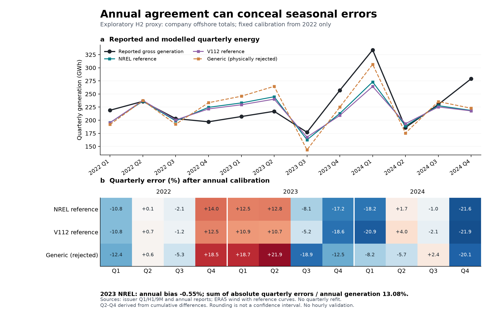

# Supplementary methods for service constrained AI flexibility

Revision v1.8 review edition | 27 September 2026 | Evidence consolidated through revision stage 38 (27 September 2026)

**Scope.** This supplement consolidates the implemented revision methods and their evidence limits. It accompanies the current review manuscript and does not certify a complete provincial experiment. Detailed derivations, source reports and runbooks remain available through the package evidence index. The historical v1.4 supplement is archived separately.

## S1 Fixed work and retrospective service benchmarks

A target job retains its recorded GPU gang size and must execute once, continuously and without preemption. Its work proxy is recorded GPU count multiplied by recorded runtime. A selected mode changes the modeled runtime according to its normalized throughput. Submission is the release time; historical completion plus 0, 6 or 24 hours is the completion benchmark. These are analyst-defined retrospective service conditions. Recorded waiting does not establish willingness to accept further delay.

All other allocations remain fixed background, including unsuccessful jobs and jobs crossing the cohort boundary. The same 192-hour horizon is retained in every policy, including the next day's background. No job is removed or deadline extended to repair an infeasible comparison. A fractional workload relaxation and a fixed-gang construction are distinct representations: feasibility of the former does not establish physical gang packing. Device placement, heterogeneity, communication topology and useful-work quality remain additional constraints.

The constructive replay releases one job's original reservation while retaining all others, chooses a feasible continuous interval and keeps the original reservation as fallback. Raw-record validation reconstructs work, completion and event-level capacity independently. Cases limited by solver resources remain unresolved; they must not be labeled infeasible or discarded.

## S2 Four policy cells and deterministic attribution

The C00, C10, C01 and C11 cells hold the cohort, power assumptions, price shape and retrospective information fixed. Their only permissions are mode choice and start-time choice. The C10 end time may change. All four cells minimize the same conditional GPU bill rather than a mixture of energy and system-cost objectives.

C10 and C01 each use one improvement sweep from C00. C11 starts from the cheaper parent and applies one sweep with both permissions. Accepting only strict improvements preserves the available parent result. For a single job at a fixed mode, candidate starts are feasible-interval boundaries, price breakpoints and breakpoints shifted by runtime. This gives an exact update for that job with the other reservations fixed, not a globally optimal schedule.

Let C00, C10, C01 and C11 denote costs under the specified permissions. The symmetric allocations to mode choice and start-time choice are

$$
M = \frac{(C_{00}-C_{10})+(C_{01}-C_{11})}{2}
$$

$$
T = \frac{(C_{00}-C_{01})+(C_{10}-C_{11})}{2}
$$

The allocations add to the joint cost reduction. We report both marginal orders and their interaction. This is a policy-based allocation, not an invariant physical split between energy efficiency and flexibility.

A separate per-job optimization removes competition for shared GPU capacity while retaining each job's gang size, work and service window. Summed minima bound optimal cell costs below; feasible schedules bound them above. Nested feasible-set inequalities further constrain those costs. A linear-fractional optimization bounds the mode share of optimal joint savings; an independent vertex enumeration checks the result. These are deterministic identification bounds conditional on the model. They are not confidence intervals.

With fixed observed start and zero additional completion allowance, a mode strictly slower than the unique reference speed cannot complete the fixed work. Hence C10 equals C00. For globally optimal nested cells and positive joint savings, the symmetric mode share is at most one half. The premise excludes another equally fast low-power mode, spare baseline speed headroom or changed output quality.

## S3 Whole node power and a common observation horizon

The GPU-only replay cannot be combined with idle power from a different machine to claim measured whole-node savings. A hardware experiment must measure useful work, output quality, active and idle energy, switching and checkpoint costs, and any cooling boundary on the same setup. Reference and controlled executions must be evaluated through a common end state and horizon.

For equal useful work on the same node, suppose both policies start together and return to the same constant idle state before a common horizon. Let reference and controlled active energies be Eᵣ and Eₘ, their durations Tᵣ and Tₘ, common idle power P₀, and additional non-double-counted control energy and duration K and τ. With the controlled task no faster than the reference, the common-horizon energy reduction is

$$
\Delta E = E_r-E_m-K+P_0(T_m+\tau-T_r)
$$

This identity applies only if both executions and all control overhead fit inside the horizon. An active-energy saving exceeding the additional control energy is sufficient for positive total saving under these assumptions. It does not identify an exact percentage without the remaining power measurements. Different idle states, a shutdown opportunity, subsequent useful work, time-varying prices or a grid-cost objective require different comparisons.

The existing external whole-node reanalysis concerns published means from different hardware. Rounding margins are not variability bounds, and a mean runtime below a deadline does not establish per-run or tail-latency compliance. No new hardware run is included in this package. The measurement protocol and empty intake tables are provided; physical measurements remain outstanding. On 27 September 2026 the authors' project contact reported that no field data or equipment were currently available.

## S4 Demand and cohort accounting

For a genuinely incremental cohort, B is background demand that already excludes it, and Aᵖ is its power under policy p. For an embedded cohort, observed total L contains reference cohort Aʳ, which must first be removed. The accounting is

$$
D^p=B+A^p
$$

$$
B=L-A^r
$$

The same B is used in every arm. The reference policy must reconstruct L exactly. Inputs require compatible node identities, power boundaries and complete timezone-aware uniform intervals. Negative background is rejected, not clipped; intervals are not silently shifted or filled. Cohort power is mandatory demand and cannot be shed to disguise failure to serve the work.

The synthetic two-hour example in the main text fixes total L at [8, 8] MW, reference cohort at [4, 0] MW and controlled cohort at [0, 2] MW. Correct accounting yields background [4, 8] MW and raises peak demand from 8 to 10 MW. Re-adding the cohort to L instead produces a false peak reduction from 12 to 10 MW. A fixed linear supply-cost functional would cancel a common additive error in policy differences; capacity investment and commitment need not.

The trace-to-grid test retains four certified 192-hour trajectories from the Earth fine-tuning, 6-hour allowance, Jiangsu-price condition. Its 0.5 kW full-load whole-node power per GPU, 0.41 idle ratio and 3 MW background are declared test assumptions. The treated electricity cohort is the whole replicated cluster, including idle and fixed background GPU work. Removing it does not mean removing all social AI demand or only the rescheduled jobs.

## S5 Electricity system components and operating boundaries

The revised mathematical components distinguish unit commitment, storage and reservoir balances, industrial private-site supply and external grid interfaces. Investments and operational states are separate objects. A no-cohort reference must not change with the scale of a cohort that is absent. Across policy comparisons, background demand, installed assets and evaluation conditions are held fixed unless the experiment explicitly tests investment.

Pumped storage consumes electricity before later discharge and requires a state-of-charge balance; it is not zero-cost natural inflow. Reservoir operation requires a water or energy budget and specified initial and terminal states. Unit commitment includes binary operating and startup decisions, minimum output and relevant ramp or minimum-time obligations. Passing synthetic checks for these constraints does not provide actual generator parameters.

Industrial by-product gas requires a shared process-gas balance, other process uses, flare and finite gas-storage treatment where applicable. Private-site power must include mandatory industrial demand and auxiliary consumption before defining signed grid import or export. An inventory's gross capacity does not establish its independently dispatchable export. Annual steel-business electricity and self-generation percentages are not interchangeable with unit-level or site net-meter observations.

Candidate operating assets cannot inherit prospective new-build capacity rights. The existing gas fleet and future OCGT investment options are separately represented; unresolved construction permissions and capacity limits remain explicit. Historical average efficiency or generic heat-extraction coefficients are conditional references, not measured heat-rate or heat-service curves for Chinese units.

## S6 Technology and physical asset identity

The frozen source cohort has 109 records totaling 24,959 MW. Before alias review, it contains 97 combined-cycle records and 12 industrial by-product-gas steam-turbine records. Source CHP fields are not complete heat contracts: an unknown entry cannot become zero heat demand. Nineteen unit-name cells have Excel date formatting; original IDs and values are retained rather than guessing the intended labels.

The Funing research adjudication groups records G100000405489 with G100000412495, and G100000405490 with G100000412494. Both project pages cite the same government project account and their Chinese aliases match the operator's two-unit commissioning description. Different coordinates and ownership aggregation are retained. This is a documented inference, not a database-author correction or equipment serial-number inspection.

| Candidate class after the one alias adjudication | Assets | MW |
|---|---:|---:|
| CCGT with reported CHP | 80 | 17,653 |
| CCGT with unresolved heat service | 15 | 5,981 |
| Industrial by-product-gas steam turbine | 12 | 1,125 |
| Total candidate view | 107 | 24,759 |

All 109 source IDs remain addressable. The other 105 source records have not passed complete physical identity review. A proximity screen is only a review aid and cannot certify that all aliases have been found. The view retains the legacy conditional 2030 membership; it does not establish operation or survival in 2030. No complete operating parameter set is admitted by this procedure.

## S7 Renewable generation and temporal validation

An explicit meteorological source, correct timestamps and a reproducible conversion do not by themselves establish actual generation. The revision separates technology, siting, equipment, capacity vintage and electrical-meter boundaries. Applying historical weather to modern fixed capacity is a planning scenario, not necessarily a historical fleet reconstruction.

The offshore diagnostic derives twelve quarters from company quarterly, half-year and annual disclosures. Reported generation and grid-delivered energy remain distinct. Adjacent quarters share cumulative endpoints; their errors are not independent. Mapping company-controlled offshore generation to the H2 proxy is an evidence-supported scope inference that still requires operational confirmation.

The 2022 calibration coefficient is held fixed. No quarterly fitting, favorable-curve selection or physical clipping is used to repair the later results. In 2023, the NREL reference has an annual signed error of −0.551% while the absolute quarterly errors sum to 13.075% of annual generation (Fig. S1). Approximately 95.785% of the absolute quarterly discrepancy cancels in the annual sum. This is a descriptive identity, not model acceptance or statistical confidence. The exercise is exploratory because relevant outcomes were already inspected.

Hourly generation, extreme-period performance, independently matched equipment and operating losses, and further regions still require validation. Old weather acquisition remains paused. Re-downloading already examined periods would not turn them into untouched holdouts.

## S8 Mechanisms and decision time information

The procurement framework distinguishes the forecast information used to choose an offer from the realization used to evaluate it. Participation costs and payments are separately accounted; an offer set includes the option to procure nothing. Payments are transfers and must not be confused with real resource savings. The original maximum-event-reduction rule cannot represent every possible event contract.

With nonlinear grid costs, a follower's responses tied on bill cost can have different supply costs. For the synthetic family with no first-period consumption and a split x and 1−x over two recovery periods, the linear forecast extrema place all recovery in one period. One startup then costs 10. Every interior split requires two startups and costs 20. Thus even checking all extreme points can miss the maximum supply cost over the continuous follower-optimal set.

A general pessimistic mechanism must optimize over that response set under the relevant grid objective, or specify an implementable selection rule. The current implementation evaluates frozen responses with endogenous commitment; it does not solve a general strategic bilevel market. Historical forecast vintages have not been admitted for the three provinces. Regulatory publication requirements do not prove that a specific historical forecast was accessible to a participant at decision time.

## S9 Validation and remaining integration

Mathematical checks use known analytical answers, independent enumeration or independent reconstruction rather than merely comparing a function with itself. Infeasible, unresolved and successful cases retain distinct status. Field preservation, source dates, reference scope and original hashes are audited separately from solver behavior. Counts of checks do not measure empirical replication.

The current source-recovery workflow has been exercised for a limited chain in a fresh clone and isolated environment, with an explicitly reviewed tariff-page version. It has not established exact recovery of every historical byte or second-machine reproduction of the complete paper. Each current-package file has a manifest entry; external raw archives and prepared arrays require their own restoration.

The full provincial experiment remains open: match useful-work quality and common-hardware power; obtain actual service and topology requirements; resolve heat, industrial, water, demand and exchange boundaries; evaluate mechanisms under historical information; choose investment once and retain it through complete held-out years and stress events. Main text, final figures, final supplementary data, bibliography and cover letter must then be checked against one authoritative results set.

## Figure S1

**Figure S1. Annual agreement can conceal seasonal errors.** Quarterly company offshore-generation disclosures are compared with reference conversion shapes using the fixed 2022 calibration. The generic curve is retained as a physically rejected diagnostic. Quarterly observations are reconstructed from cumulative disclosures and share endpoints. This is an exploratory company-scope/H2-proxy comparison, not validated provincial hourly wind supply. Reproduced unchanged from revision stage 19.

## S10 Corrected external benchmark extraction

The MLCommons Inference v4.0 repository is pinned to commit 343c3d2cb03f2ae02b1023a44e4a45ba4b8422ef. We match the NVIDIA DGX-H100_H100-SXM-80GBx8_TRT and its MaxQ variant on benchmark, accuracy profile and scenario. System descriptions agree except for the system name. This establishes matching submitted descriptions, not independently inspected hardware identity.

Configuration classes are parsed as syntax trees without executing vendor code. An absent local power_limit assignment is resolved through the named parent class; unsupported or ambiguous inheritance is rejected. Four stage-37 rows were incorrectly assigned caps from other hardware classes: DLRM-v2-99.9 Offline/Server and Llama2-70b-99.9 Offline/Server all resolve to 450 W. Performance ratios are unaffected.

For each capped run, we read power_begin and power_end from mlperf_log_detail.txt and select aggregate Watts samples in run_1/spl.txt within the inclusive interval. We average the aggregate channel once; summing its component channels again would double count energy. Samples must be increasing, positive and cover both boundaries; no extrapolation is performed. Dates are parsed in the submitted month-day-year format. We use the timestamps as supplied without an inferred timezone shift. Clock synchronization remains dependent on the submission's measurement process.

The 24 window sample means range from 4.115 to 5.960 kW. These replace the v1.7 broader-session means of 3.777 to 5.377 kW, which included time outside the performance window. An independent decimal-arithmetic extraction reproduces every window mean within 1e-9 W and every sample count exactly. This tolerance checks arithmetic, not instrument uncertainty. These sample means are not common-horizon energy estimates or official recertified benchmark scores.

The complete Git tree contains no power-directory or spl.txt file under the matched standard-system result tree. Therefore paired AC savings remain unavailable. Accuracy files are present, but their model-specific thresholds were not independently rerun or validated. Shared runs across accuracy profiles are not independent repetitions.

Sources: MLCommons, Inference v4.0 result repository, https://github.com/mlcommons/inference_results_v4.0 (pinned commit above); MLCommons, Power measurement rules, https://github.com/mlcommons/inference_policies/blob/master/power_measurement.adoc (accessed 27 September 2026). The row-level source hashes accompany the correction record.

## S11 Prospective field evidence and placement validation

The field experiment has not been conducted. The intake requires both policy arms on a common node, all PSU AC inputs, fixed useful work, quality criteria, randomized paired repeats, full-window idle and control overhead, and a frozen stopping rule. The existing measurement protocol defines these requirements. Empty CSV headers are schemas, not measurements.

Service records must link each job to a versioned contract effective at arrival. Release, deadline, latency percentile or violation threshold, quality requirement, and the evidence source remain explicit. Historical completion plus an analyst-selected allowance cannot populate a contractual deadline field. Anonymous stable job and node identifiers preserve joins without publishing customer identities or contracts.

Placement validation additionally requires per-GPU identity and model, memory and availability, node membership, interconnect endpoints and link capacity, and timestamped job-device assignments. A gang must simultaneously obtain its required devices; communication and memory constraints must be checked on that placement. Aggregate free-GPU counts alone do not prove deployability. No actual contract or topology record is present in this edition.

## S12 Provincial input admission and full-year evaluation

Before a provincial experiment, the load series must have a documented statistical boundary, units, timezone, actual calendar, and embedded-versus-incremental AI cohort treatment. A historical shape scaled to an annual total is a constructed series, not measured hourly demand. Province-level assets require matched identity, technology, capacity vintage, retirement/commissioning status and operational constraints. Gross industrial capacity is not net grid export. Heat obligations and shared process fuel remain mandatory where applicable. Exchanges require directional capability and simultaneous flow or explicitly stated scenario constraints. Reservoir inflow, usable storage, head/efficiency and release requirements must refer to compatible physical boundaries.

Renewable profiles require matched onshore/offshore/PV technology, equipment assumptions, capacity vintage, meteorological source, conversion and losses, and observations with the same fleet and meter scope. Annual agreement alone cannot validate hourly reliability. None of the existing candidate lists closes all of these admission requirements. The accompanying provincial register records what exists and what is missing; it is not a replacement input dataset.

The prospective evaluation sequence is: (1) admit and hash inputs, define the training/test split and record all previous exposure; (2) choose policies, hyperparameters and investment using development data only; (3) freeze generation, network and storage investment; (4) evaluate every hour of each test year without investment refitting; (5) retain energy-state continuity and initial/terminal conditions, serve the same workload, and record infeasible and unresolved cases; (6) report minimum unserved energy, shortage hours, cost, emissions, service violations and solver gaps; (7) evaluate predeclared stress and outage scenarios. A leap year has 8,784 hours; otherwise 8,760.

The implemented annual evaluator first minimizes unserved energy, then minimizes operating cost at that shortage level. Synthetic tests exercise complete years, binary commitment and cross-midnight storage. They do not establish empirical provincial reliability. Perfect-foresight dispatch is an optimistic diagnostic and cannot replace causal dispatch using archived forecasts. Deterministic shortage hours are not stochastic LOLE. A stochastic adequacy claim additionally needs outage distributions, dependence and a defined sampling/uncertainty procedure.

No untouched test year is designated here: weather from 2015–2024 has already been inspected. A future holdout or independently sequestered dataset must be selected before its outcomes are examined. Any evaluation of already examined periods must be labeled retrospective or exploratory. Full-year provincial validation remains unexecuted because its physical inputs are not admitted.

## S13 Supplementary data contents

Supplementary Data 1 is a review workbook with a gate register, 108 certified conditional factorial outcomes, 24 corrected external benchmark rows and a provincial input register. These are distinct evidence types. Percent columns inherited from the factorial output store percentages on a 0–100 scale, whereas performance retention is a ratio (0–1). Missing measured energy and empirical provincial results are not represented as zero. Complete CSV copies and file hashes accompany the workbook. Data and manuscript finalization requires resolution of the remaining gates.
