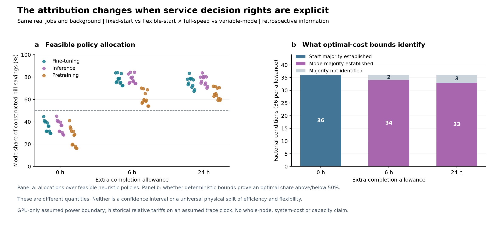

# 服务约束与功率测量边界如何影响灵活 AI 计算的电网价值

William Wei¹ ² 和 Lanlan Liu³

¹ 英国利兹大学工程与物理科学学部计算机学院，英国利兹

² Spatial Computing (Fujian) Technology Co., Ltd.，中国福州

³ 福建师范大学公共管理学院，中国福州

通讯邮箱：qkfp0742@leeds.ac.uk

v1.8 纠错审读版中文译稿｜2026 年 9 月 27 日｜证据整合至修订阶段 38

**稿件状态。** 本版整合已有证据支持的修订结果、阶段 36 文献审计及阶段 37 公开功率边界审计，并纳入阶段 38 的纠错。当前尚不具备最终投稿条件，也不替代已投稿的 v1.4。省级系统收益、全年可靠容量及可实施市场机制的比较仍需重新计算。题目和摘要为暂定，作者信息沿用 v1.4。

**译稿说明。** 正文、表格和图注译为中文；文献著录及图内英文标签保留原文，方便核对。本文中的“验证”须结合相应证据范围理解，不能把数学检查、条件模型回放或外部数据复算理解为本文新增现场实验。

## 摘要

灵活人工智能计算的价值取决于必须维持的服务要求、功率测量的边界，以及承接负荷响应的电力系统。我们构建了一个框架，在固定工作量、GPU 需求和明确完成基准的前提下，区分运行模式变化与任务启动时间变化。在基于生产轨迹构造的 108 个配对条件中，没有额外完成宽限时，固定启动策略不能降低任务速度；宽限增加后，在大多数但非全部条件下，模式调整占可识别电费降低机会的多数。这些结果来自条件性 GPU 功率模型，并非整机或电网节能实测。对外部同系统的 24 条官方八卡 H100 基准记录进行审计后发现，限功率运行保留了常规性能的 65.13%–82.03%，但常规侧缺少交流整机功率日志，因此无法识别整机节能。两个解析反例说明，将计算侧结果转化为电网价值需要格外审慎：研究负荷群体的记账不一致可能逆转容量结论；考虑机组启停后，线性响应端点不一定构成供电成本的上下界。对可再生能源曲线和发电资产的审计进一步揭示，仅凭年度总量吻合或数据库编号唯一，仍不足以作出物理判断。这些结果共同构成了评估服务保持型计算灵活性的可检验框架。完整的省级估计仍需要同硬件功率测量、口径匹配的需求与发电边界、历史决策时信息，以及固定投资后的全年验证。

## 引言

AI 计算灵活性已经有实证基础。一项 256 GPU 的现场示范报告称，在维持所述服务质量保证的同时，将功率降低 25% 并持续三小时 [1]；随后一项 130 kW 部署报告了快速且持续的负荷削减、碳感知运行和空间转移，同时保持优先任务的服务水平 [2]。基于轨迹的量化也已存在：一项覆盖逾百万条阿里巴巴任务的研究，利用观察到的排队延迟划分可推迟工作，在响应窗口内得到最高 22% 的模型负荷削减 [3]。这些研究证明了技术能力，但服务定义、任务群体、功率边界和信息集并不相同。

电力系统规划研究已经表明，时间灵活性能够改变投资、运行成本、排放和资源充裕性 [4–6]。空间迁移与区域算力分配也早有研究 [7–9]，并网义务、市场报酬与信号协调机制同样已有提案 [10–12]。因此，本文不主张首次证明 AI 计算灵活性、首次使用生产轨迹、首次建立系统价值模型，或首次提出协调机制。本文研究的问题更为具体：能否在同一固定任务群体和完成基准下，对运行模式和启动时间决策进行归因；以及在将这种归因转化为物理电网价值主张之前，还需要哪些证据。

本文的贡献是受控的边界检验。我们比较四组策略，仅改变启动时间和运行模式的调整权限，保持工作量、GPU 需求、背景占用、电价及完成基准相同。随后通过两个解析反例，以及对功率、需求和供给输入的审计，检验结果如何转化到电力系统。下文仅报告这一证据链能够支持的部分。原先的省级收益范围及燃气容量避免建设估计保留为历史情景输出，不作为本版的修订结论。

## 结果

### 完成基准会改变归因

我们保留原始 GPU 数量，并以记录的 GPU 数乘以运行时间作为工作量代理。每个目标任务只执行一次，在连续区间内运行且不被抢占。其余记录的资源分配保持为固定背景。任务群体来自四个公开 Helios 生产集群 [13]。完成基准设为历史结束时间加上分析者指定的 0、6 或 24 小时宽限。这是回顾性比较，不能由排队时间反推出具有契约效力的服务水平协议（SLA）[E1]。

四组策略仅在启动时间和运行模式的调整权限上不同。它们共享任务群体、背景分配、电价、功率假设及回顾性信息。C10 保持观察到的启动时间，但允许稍后完成，因此属于固定启动策略，不能被视为物理上完全不改变时间的纯能效策略。

| 策略 | 启动时间 | 运行模式 |
|---|---|---|
| C00 | 历史启动时间 | 基准全速 |
| C10 | 历史启动时间 | 允许选择模式 |
| C01 | 可在固定窗口内调整 | 基准全速 |
| C11 | 可在固定窗口内调整 | 允许选择模式 |

四月份比较包含 28,716 个不同目标任务，覆盖四个集群、三种曲线分配、三种完成宽限和三种电价形状，由此得到 108 个条件、432 份构造排程。不同条件重复使用任务和相关曲线，因此不是独立统计重复。全部排程通过了独立的工作量、服务窗口和聚合 GPU 容量检查 [E2]。构造方法是单轮改进的可行启发式方法，并非全局最优性证明。

| 额外完成宽限 | 条件数 | 构造电费节省中模式调整占比 | 由界限识别的最优多数归因 |
|---|---:|---:|---|
| 0 小时 | 36 | 16.38%–45.00% | 36 个条件均为启动时间调整占多数 |
| 6 小时 | 36 | 54.04%–84.41% | 34 个条件模式调整占多数；2 个未识别 |
| 24 小时 | 36 | 58.98%–83.76% | 33 个条件模式调整占多数；3 个未识别 |

可行策略成本和松弛下界共同确定最优归因的确定性识别区间（图 1）。构造排程中的模式调整占多数，不代表全局最优解中也占多数；仍有五个条件无法识别。电费包含固定背景和假设的 GPU 空闲耗电，既不是真实客户账单，也不是系统成本估计。历史电价形状来自省级公开文件 [14–16]，作为明确声明的假设电价条件应用于轨迹时间轴 [E2]。

零宽限结果具有结构性原因。如果记录运行时间定义了全速工作量，所有备选模式均严格更慢，且历史启动与完成时刻都固定，那么较慢模式无法完成固定工作量。因此 C10 等于 C00。对于嵌套的最优策略集合，在总节省为正时，对称归因中的模式份额不超过一半。这一结论限于本文的决策矩阵与工作量定义，不是硬件能效贡献的普遍上界。

尽管模型 GPU 能耗下降，108 个构造联合策略中仍有 57 个的小时 GPU 峰值高于基准，最大增幅为 11.37%。这里是按共同时间轴汇总的集群 GPU 峰值，不是电力系统同时峰值或并网容量需求。它说明，仅有能耗下降不足以证明容量价值 [E2]。

### 在明确假设下将固定服务回放扩展到其他时段

另一个固定日历的验证覆盖 2020 年 5 月、7 月和 9 月的 12 个集群—周群体，共 118,703 条不同作业记录。八种曲线标签与三种完成宽限形成 288 个配对条件。所有构造排程均通过基于原始记录的独立工作量、窗口及事件级容量检查。所选任务占对应源周 GPU 占用的 26.62%–40.59%，其余占用保留为背景 [E1]。

所有策略都保留 192 小时范围，包括源周结束后观察到的尾部。成功回放验证的是聚合 GPU 容量及假设曲线迁移条件下的排程；它并未证明具体设备放置、模型可用性、网络拓扑、输出质量、实际服务契约、在线控制或整机节能。这些约束在实际部署示范和推理集群研究中具有实质影响 [1,2,17,18]。这些额外时段是在此前已检查轨迹后，对冻结构造方法进行验证，不是新的前瞻性部署实验。

### 记账边界可能逆转容量比较

受控负荷群体必须且只能计入一次。如果输入的需求序列已包含该群体的基准耗电，应先扣除基准群体，再构建共同背景。否则，每组策略都会重复计入一份基准负荷，从而可能改变容量和启停决策 [E3]。

一个两小时例子可说明其后果。观察到的总负荷为 [8, 8] MW，其中包含基准群体 [4, 0] MW，因此共同背景为 [4, 8] MW。受控群体 [0, 2] MW 会使真实峰值从 8 升至 10 MW；重复记账却使表观峰值从 12 降至 10 MW。在例子选定的投资与可变成本下，对应总成本分别由 160 变为 170、由 220 变为 190。这个例子证明符号可能逆转，并不确定这种错误在省级论文中的影响大小。

已实现的记账模块支持真正新增和已包含于总负荷的两类群体，保持共同背景，并拒绝不兼容时间轴或负的重建背景。四条完整且已核验的任务—策略轨迹已覆盖全部 192 小时接入电网接口。整机功率换算与 3 MW 背景仍是明确的测试假设，并非已校准的江苏需求 [E3]。

### 线性采购界限不能界定非线性供电成本

修订后的机制比较将购买响应时可用的信息，与事后用于评价的实现结果分开。既有工作已研究时空报酬及信号协调 [11,12]；本文更窄的检验是在评价实际电网结果前固定所购买的响应。固定响应进入具有相同已装资产和背景需求的同一个电网模型。机组启停和调度可以随负荷变化，但不能在看到系统实现结果后重新选择响应 [E4]。

一个连续响应反例表明，使线性预测目标达到最小和最大的端点，不一定包住实际供电成本。如果负荷恢复可发生在两个小时中的任一小时，而每个小时需要一台不同的初始停机机组，那么端点只启动一台机组，内部分摊则需要两台。设可变成本为零、每台启动成本为 10，两个端点的成本均为 10，而所有内部分摊的成本均为 20。这些是为证明而设置的合成单位。因此，机组启停内生时，仅评价线性极端点可能漏掉物理系统的最坏情况。

该结果限制了此前事件合同比较可以得出的结论。一种事件规则失效，不代表事件采购普遍劣于其他机制。完整响应集合上的一般悲观采购、可实施的响应选择规则、历史预测版本及供应方策略行为仍未解决。由协调解事后导出的价格仍只是基准，不是可部署电价的证据 [E4]。

### 物理供给输入不能只依赖总量吻合

经审计的供给数据链使用公开再分析、天气、省级负荷、电力系统和资产数据包 [19–23]，但确认来源不等于完成物理校准。一项探索性海上风电诊断固定 2022 年年度校准，并比较随后公司披露与模型发电量。2023 年 NREL 参考曲线的年度误差为 −0.551%，但季度绝对误差之和占年度实际发电量的 13.075%。年度总量掩盖了方向相反的季节误差。披露范围是公司控制的海上风电，其归属于 H2 代理仍是基于证据的推断；季度序列也不是小时电表记录 [E5]。

资产清单审计还区分了数据库记录身份与物理资产身份。选定的油气机组群体最初有 109 条源记录，共 24,959 MW。技术字段识别出 97 条联合循环记录与 12 条工业副产煤气蒸汽轮机记录，因此不能把同一套开式循环燃气轮机（OCGT）参数用于全部记录。阜宁的两组条目引用同一项目来源，并与运营方关于两台机组的描述对应。明确记录的研究别名裁决将四条记录映射到两个候选资产，使候选总数变为 107 个、24,759 MW。原始编号和元数据冲突均被保留 [E6]。

修订视图包括 95 个联合循环（CCGT）候选，其中 80 个被报告为热电联产（CHP）、15 个供热状态未明确，另有 12 个工业候选。它并非经确认的 2030 年运行机组集合。供热义务、工业燃料共享、与电网的净交换接口、投产退役时间及机组运行限制仍需证据。不能把 200 MW 的记账修正或很小的可再生能源年度误差，直接换算为修正后的系统收益百分比。

### 公开同系统功率证据仍只有单侧

近期高分辨率训练数据包含八卡 H100 和 B200 节点上、20 ms 分辨率的 32 次会话，但其中“节点功率”是 GPU 遥测之和，因为无法访问整机功率 [24]。这些轨迹能够刻画快速设备动态，却不测量服务器或设施的交流输入。

我们另从固定提交版本的 MLPerf Inference v4.0 官方仓库提取了配对 NVIDIA 结果 [25]。常规与 MaxQ 系统说明除名称外具有相同的 DGX H100 硬件和软件字段。24 条基准—精度—场景配对记录中，两侧均有有效性能摘要和可取得的精度记录；本研究未独立重新验证精度阈值。MaxQ 保留了常规性能的 65.13%–82.03%，中位数为 74.57%。将提交的 Yokogawa 总功率样本按 LoadGen 起止时刻截取后，二次提取得到样本均值 4.115–5.960 kW，每行至少有 600 个样本。这替代 v1.7 使用的较长会话均值。四条继承而来的 GPU 功率上限也已修正为 450 W，配对性能比例未变。本次提取不是官方基准重新认证，也未独立确认时钟同步或共同物理序列号。部分精度目标共享同一性能运行，不能视为独立重复。

MLPerf 要求系统级交流测量、覆盖活动主机部件，并使用同一次运行中的功率和性能 [26]。但匹配的常规侧没有提交功率日志。因此，这组公开数据支持任务相关的服务性能比较和实测 MaxQ 功率水平，却无法识别整机功率变化、单位完成样本能耗变化或节能量。同硬件是必要但不充分的条件：两种运行方式必须在相同测量边界内完成相匹配的有效工作并保持质量 [E8]。

## 讨论

现有证据支持的结论是：归因和系统价值依赖明确的服务、功率及供给边界。外部基准审计使测量要求更加具体：如果常规对照没有功率测量，一次有效的限功率运行不能证明节能。文献审计表明，能力示范、基于轨迹的任务推迟及电网价值建模都已是既有研究方向，创新不能仅建立在其中任意一项之上。在本文检验的决策权限下，模式选择的表观贡献随完成宽限变化。能耗下降可能与更高 GPU 峰值同时出现；考虑负荷恢复和机组启停后，数学上可行的任务响应也可能不利于电网。这些发现能够指导测量与实验设计，但尚未量化三个省份实际 AI 集群的电网价值。

完整的实证主张需要在同硬件上完成相同有效工作并保持质量，同时在明确的交流边界测量空闲、运行和切换能耗。需求序列必须明确受控群体是否已经包含在内。发电与输电数据必须具有相容的年代口径、燃料及供热义务、水量和储能守恒，以及物理可用的输入电力。机制应获得可比信息，并基于实现结果评价，不能事后选择。

后续系统研究应在声明的训练信息集上仅选择一次投资，然后让固定资产组合运行于完整留出时段，保留失败、相关停运、极端条件和期末未完成义务。已经检查过的天气年份不能仅因重新下载就变成未接触过的测试集。在这条证据链完成之前，原先的省级降低范围、吉瓦级避免建设容量及价格—性能主张应留在历史投稿中，不应进入修订摘要。

## 方法概述

补充审读稿规定了固定服务任务群体、策略目标、确定性界限、共同观察窗口的功率记账、需求账目和电网接口。数学验证根据问题采用独立事件扫描、解析案例、枚举或标量运算。来源验证记录日期、范围、原始编号、文件哈希及未解决解释。哈希证明版本一致，不证明来源内容正确。

现有代码包括机组启停、能量守恒的储能和水库、工业共享燃料及厂区电网接口、固定群体需求构造和条件机制评价。外部基准审计是从固定公开结果仓库进行的确定性提取：比较匹配的性能与精度记录、MaxQ 交流功率日志和系统说明，没有把这些数据拟合到 Helios 排程。这些组件已有数学检查，但尚未组装为完整校准的省级实验。检查数量表示实现覆盖程度，不是科学样本量或期刊就绪证据。

## 数据与代码可用性

研究仓库为 https://github.com/william19307/ai-grid-flexibility-research ，分支为 codex/research-evidence-revision。调度与物理边界结果保留各阶段冻结的证据提交；文献及创新性审计锚定于 510780e9ead27698e33cedf24df5a5a171a8f11b，原公开功率边界审计锚定于 b6da0c7。阶段 38 纠正了该提取；纠正后的源文件哈希和独立算术检查见英文包 data/mlperf_source_manifest.json 与 data/mlperf_independent_verification.json。包内包含证据索引和来源哈希。外部原始档案、准备数组及本地环境需按 REPRODUCE.md 恢复；仅克隆仓库不能复现全部研究。本文不声称新增了硬件实测。

## 参考文献

1. Colangelo, P. et al. AI data centres as grid-interactive assets. Nat. Energy 11, 254–261 (2026). https://doi.org/10.1038/s41560-025-01927-1

2. Williams, C. et al. Power-flexible AI data centers: a new paradigm for grid-responsive compute. Preprint at https://arxiv.org/abs/2606.25098 (2026).

3. Caprara, A., Yu, Y., Teng, F., Junyent-Ferré, A., Bullich-Massagué, E. & Aragüés-Peñalba, M. Data center workload flexibility for power system demand response: evidence from Alibaba traces. Int. J. Electr. Power Energy Syst. 178, 111940 (2026). https://doi.org/10.1016/j.ijepes.2026.111940

4. Senga, J. R. L., Wang, S. & Knittel, C. R. Flexible data centers reduce power system costs but can increase emissions. iScience 29, 116497 (2026). https://doi.org/10.1016/j.isci.2026.116497

5. Chen, Y. & Zheng, X. To defer or to shift? The role of AI data center flexibility on grid interconnection. In Proc. 2026 ACM Sustainability Week 322–327 (ACM, 2026). https://doi.org/10.1145/3765611.3815593

6. Dunlap, C. Quantifying AI data center flexibility as a resource adequacy asset. Research Square preprint https://doi.org/10.21203/rs.3.rs-9829457/v1 (2026).

7. Zheng, J., Chien, A. A. & Suh, S. Mitigating curtailment and carbon emissions through load migration between data centers. Joule 4, 2208–2222 (2020). https://doi.org/10.1016/j.joule.2020.08.001

8. Fridgen, G., Keller, R., Thimmel, M. & Wederhake, L. Shifting load through space: the economics of spatial demand side management using distributed data centers. Energy Policy 109, 400–413 (2017). https://doi.org/10.1016/j.enpol.2017.07.018

9. Zhang, Y., Li, H. & Wang, S. Decarbonizing data centers through regional bits migration: a comprehensive assessment of China's “Eastern Data, Western Computing” initiative and its global implications. Appl. Energy 392, 126020 (2025). https://doi.org/10.1016/j.apenergy.2025.126020

10. Birahim, S. A. A net-grid-benefit test for interconnecting AI data centres. npj Environ. Soc. Sci. 1, 8 (2026). https://doi.org/10.1038/s44432-026-00013-5

11. Zhang, W. & Zavala, V. M. Remunerating space–time, load-shifting flexibility from data centers in electricity markets. Appl. Energy 326, 119930 (2022). https://doi.org/10.1016/j.apenergy.2022.119930

12. Dvorkin, V. Agent coordination via contextual regression (AgentCONCUR) for data center flexibility. Preprint at https://arxiv.org/abs/2309.16792 (2024).

13. Hu, Q., Sun, P., Yan, S., Wen, Y. & Zhang, T. Characterization and prediction of deep learning workloads in large-scale GPU datacenters. In Proc. Int. Conf. High Performance Computing, Networking, Storage and Analysis 1–15 (ACM, 2021). https://doi.org/10.1145/3458817.3476223

14. Jiangsu Provincial Development and Reform Commission. Notice on transmission–distribution and retail tariffs of the Jiangsu grid for 2020–2022, Su-Fa-Gai-Jia-Ge-Fa [2020] No. 1183, Annex 3 (2020). https://www.njqxq.gov.cn/qxqrmzf/qxqfzhggj/202011/P020201111396651530459.pdf

15. Gansu Provincial Development and Reform Commission. Notice on adjusting retail tariffs and optimising time-of-use tariffs, effective 1 January 2021 (2020). http://www.gansu.gov.cn/art/2020/12/3/art_10359_474921.html

16. Guizhou Provincial Development and Reform Commission. Notice on improving the time-of-use tariff mechanism, Qian-Fa-Gai-Jia-Ge [2023] No. 481 (2023). https://fgw.guizhou.gov.cn/zwgk/zcwj/zcwj/202306/t20230628_80566840.html

17. Du, B. et al. Spatial LLM workload shifting needs foresight: model commitment for AI data center operation under power grid constraints. Preprint at https://arxiv.org/abs/2609.09787 (2026).

18. Stojkovic, J., Zhang, C., Goiri, Í., Torrellas, J. & Choukse, E. DynamoLLM: designing LLM inference clusters for performance and energy efficiency. In Proc. IEEE Int. Symp. High-Performance Computer Architecture 1348–1362 (IEEE, 2025). https://arxiv.org/abs/2408.00741

19. Hersbach, H. et al. The ERA5 global reanalysis. Q. J. R. Meteorol. Soc. 146, 1999–2049 (2020). https://doi.org/10.1002/qj.3803

20. Zippenfenig, P. Open-Meteo.com Weather API. Zenodo https://doi.org/10.5281/zenodo.7970649 (2024).

21. Wu, H. & Kan, X. Hourly electric power load and transmission data at the provincial level in China. Zenodo https://doi.org/10.5281/zenodo.8322210 (2023).

22. Zhou, X. PyPSA-China: V3.0. Zenodo https://doi.org/10.5281/zenodo.13987282 (2024).

23. Potsdam Institute for Climate Impact Research. Data bundle PyPSA-China-PIK: rasters and basic cutout, v1.1. Zenodo https://doi.org/10.5281/zenodo.16810831 (2025).

24. Elsayed, A. A. E., Al-Obaidi, A. A. & Farag, H. E. Z. Characterization of high-resolution AI data center training workloads on single and multiple GPU nodes. Sci. Data 13, 1268 (2026). https://doi.org/10.1038/s41597-026-07496-6

25. MLCommons. MLPerf Inference v4.0 results. GitHub repository at commit 343c3d2cb03f2ae02b1023a44e4a45ba4b8422ef (2024). https://github.com/mlcommons/inference_results_v4.0

26. MLCommons. MLPerf Inference power measurement rules. https://github.com/mlcommons/inference_policies/blob/master/power_measurement.adoc (accessed 27 September 2026).

## 证据登记

E1. 修订阶段 05–06 及 service_replay_methods_draft.md：固定服务构造与固定日历的时间验证。

E2. 修订阶段 07 及 policy_attribution_methods_draft.md：108 条件策略矩阵、确定性归因界限及图 1。

E3. 修订阶段 24–26 及 demand_cohort_methods_draft.md：需求边界、容量解析反例及固定群体对照。

E4. 修订阶段 20–22 及 mechanism_grid_methods_draft.md：信息分离、采购限制及启停反例。

E5. 修订阶段 18–19 及 renewable_temporal_validation_methods_draft.md：年度和季度发电量诊断。

E6. 修订阶段 23、29–35 及 asset_identity_methods_draft.md：技术、工业边界与别名裁决。

E7. 修订阶段 36 及 literature_20260927：直接相关文献登记、元数据检查、创新矩阵及主张—引用账目。

E8. 修订阶段 37–38 及 mlperf_power_corrected：固定版本的同系统性能、精度、MaxQ 交流功率、系统身份及准入审计；替代阶段 37 的功率上限和会话均值。

随附证据索引提供固定版本仓库链接。这些标识指向研究记录，不是同行评审出版物。阶段 36–37 核查了当前参考文献、创新边界与固定版本公开功率提取，后者已由阶段 38 纠错。部分文献仍未完成全文核读；文献审计不是系统综述，MLPerf 提取也不能创造缺失的常规侧功率测量。

## 图 1

**图 1 服务调整权限改变条件性 GPU 电费归因。** a 图报告可行构造策略的对称归因；b 图报告确定性成本界限是否能够识别最优解中占多数的贡献。每种宽限包含 36 个配对条件，它们不是独立统计重复。包含固定背景和假设的 GPU 空闲功率。本图不能证明整机节能、省级系统成本或容量价值。图像原样保留自修订阶段 07。

**图内英文对照。** Fine-tuning：微调；Inference：推理；Pretraining：预训练；Extra completion allowance：额外完成宽限；Mode share of constructed bill savings：构造电费节省中模式调整占比；Start majority established：已识别启动时间调整占多数；Mode majority established：已识别模式调整占多数；Majority not identified：多数归因未识别。
