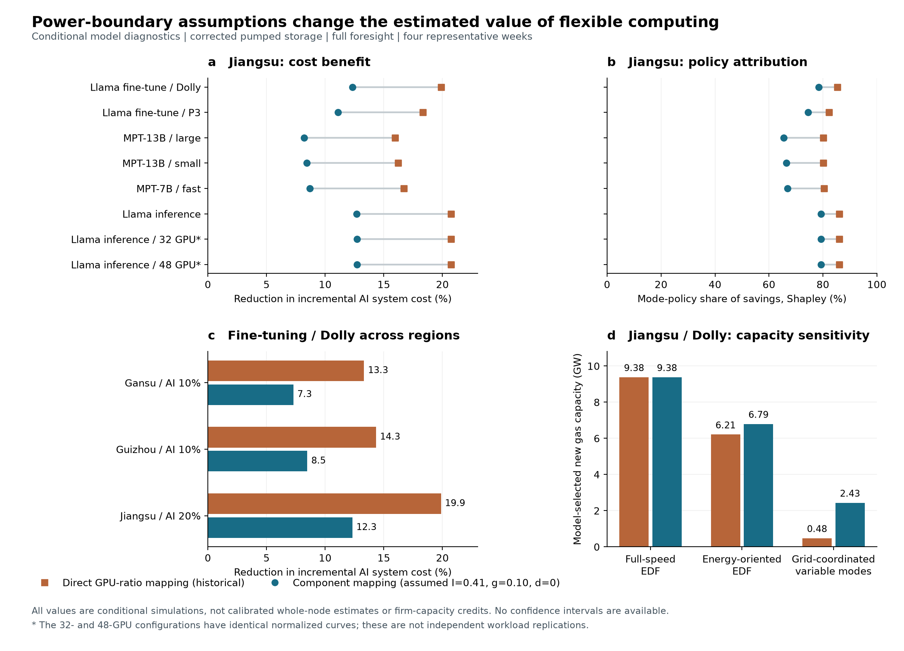

# 阶段 02：整机功率边界与四组政策对照

2026-09-22；独立修订实验，未覆盖已投稿 v1.4。现有数字不足以支撑原稿的普适性定量主张，阶段结论是识别并量化问题，不是认证达到 Nature Energy 水平。

## 主要发现

保持抽蓄为 8h、往返效率 75% 的守恒储能，并保持原始工作、服务约束、电网输入和代表周假设后，区分 GPU 与非 GPU 部件会明显减小模拟收益。下表采用 fine-tuning / Dolly，中心分量假设 I=0.41、g=0.10、d=0；比较的是相同工作量下**相对刚性 AI 的增量系统成本降低比例**，不是全系统总成本降幅。

| 情景 | 历史直接映射 GPU 比例 | 分量一致的假设映射 | 分量映射后的运行模式 Shapley 占比 |
|---|---:|---:|---:|
| 甘肃，AI 占峰荷 10% | 13.31% | 7.28% | 99.86% |
| 贵州，AI 占峰荷 10% | 14.33% | 8.47% | 88.21% |
| 江苏，AI 占峰荷 20% | 19.87% | 12.31% | 78.39% |

分量映射**尚未经整机实测校准**，不能把右列简单替代为新的正式估计。这里能可靠说明的是：原结论对功率边界的处理高度敏感。

八种配置在中心分量假设下的成本降低范围为：甘肃 4.33–7.85%、贵州 5.56–9.07%、江苏 8.20–12.70%。江苏三个预训练配置的运行模式 Shapley 占比为 65.48–66.89%，已经不足以支持不加条件的“能效几乎解释全部收益”。这些是配置范围，不是统计置信区间。

江苏 Dolly 的新增燃机选择从刚性 AI 的 9.38 GW，降到能源优先 EDF 的 6.79 GW，再到协调可变模式的 2.43 GW；历史映射下协调结果为 0.48 GW。按顺序归因，电网协调解释约 62.77% 的避免新增燃机容量，却只解释约 20.43% 的成本节省。因此成本分解不等于容量价值分解。容量数字只是当前代表周模型的投资解，不能称为经全年可靠性验证的容量信用。

## 修正了什么

### 1. 明确整机边界

新模型分别表示 GPU 功率、非 GPU 活跃/空闲功率，保证满速整机功率和空闲整机功率在同一归一化边界内。公式、原始来源及待补校准证据见 [功率证据边界与校准要求](power_attribution/功率证据边界与校准要求.md)。历史直接 GPU 比例映射保留为对照；它会受原来的最低功率模式过滤影响，不能当成另一条有效整机测量曲线。

### 2. 补齐四个政策单元

| 单元 | 运行模式 | 调度规则 |
|---|---|---|
| C00 | 满速 | 有任务就执行的最早期限优先 EDF |
| C10 | 可变模式 | 先最小化总能耗，再在该最优能耗容差内最早执行，按 EDF 分配任务 |
| C01 | 满速 | 电网成本最优的协调调度 |
| C11 | 可变模式 | 电网成本最优的协调调度 |

C10 不使用电网价格，但降低速度本身会改变完成时间，不能再把它称为“完全无时移”。其模式选择使用已知全部任务的信息，是全知基准而非已经部署的在线策略。新算法审计有已释放未完成任务时的主动空转、任务完成和到期违约；它不会在内部延长期限。不过本阶段上游任务构建仍沿用原代码的期限延长与边界截断，这个服务缺口尚未修复。

设 C 为扣除 NOAI 后的期望周系统成本（EUR/week）。总节省为 `C00−C11`，先加运行模式的收益为 `C00−C10`，后加运行模式的收益为 `C01−C11`。两条路径的平均值用于对称 Shapley 分配。协同节省 `C10+C01−C00−C11` 保留正负号，两个分配量严格加回总节省。

这是一组明确政策的会计分解，不能称为脱离基线和顺序的纯物理因果分解。江苏 Dolly 中，先加运行模式得到 79.57% 的占比，对称分配为 78.39%；交互为 −0.418 百万 EUR/week。不同配置的交互可正可负。

## 实验与复核

- 60 组配置：8 配置×3 地区×2 功率映射的 48 组，以及 Dolly 在三地区的 12 组功率分量单因素情景。
- 每组求解满速/可变模式两家族、各 7 个场景，共 840 个场景求解；全部可行，失败数为零。模型可行不能替代全年可靠性成立。
- 新增 60 项解析检查；原任务模型的 120 个独立枚举参照、256 个模式情景及成本模型的 72 条前沿/360 个承诺点回归通过。最大任务误差为约 1.10e−13。
- 独立审计从各场景输出重新计算四个单元、两条归因路径和 Shapley 值；核对输入哈希、运行前源码哈希与每组归档源码、同任务量、同刚性基线和同满速协调基线。
- 抽蓄守恒最大误差 2.91e−11 MWh；C10 在有已释放未完成任务时的最大空转比例约 1.04e−14；最优能耗容差约 1e−8 个归一化满速功率小时。
- 源数据中 32/48 GPU 推理配置归一化曲线相同，不计为独立重复证据。所有配置仍使用相同来源的 Helios 工作形态；没有验证实时推理延迟服务约束。

精确数字见 [factorial_results.csv](power_attribution/factorial_results.csv) 和 [factorial_verification.json](power_attribution/factorial_verification.json)。图形直接由审计后的表生成；PNG 已逐面板检查，另有 PDF/SVG。

## 论文必须相应改变的主张

1. 删除“GPU 实测曲线已经代表整机负荷”的暗示，将测量边界写入主文方法；未经校准时，所有省级数值只能作条件情景。
2. 用四组政策对照及交互项替代单路径“能效/时移”分解；明确降低速度本身也延后执行。
3. 分别报告成本、能耗、排放及容量选择，不能用成本占比概括所有电网价值。
4. 把不同工作负载和电网条件下的边界写成待验证的核心问题，不再把单一配置推广为所有 AI。
5. 保留未解决的整机校准、固定服务期限、独立 NOAI、常规水库水量、2030 风光存量、全年可靠性及真实机制验证门槛。当前阶段完成并不关闭这些问题。

下一步先修复无 AI 反事实和任务构建的服务约束，再重跑此政策矩阵。现有中心数字会随其他物理修正继续改变，暂不据此替换正式稿结论。
