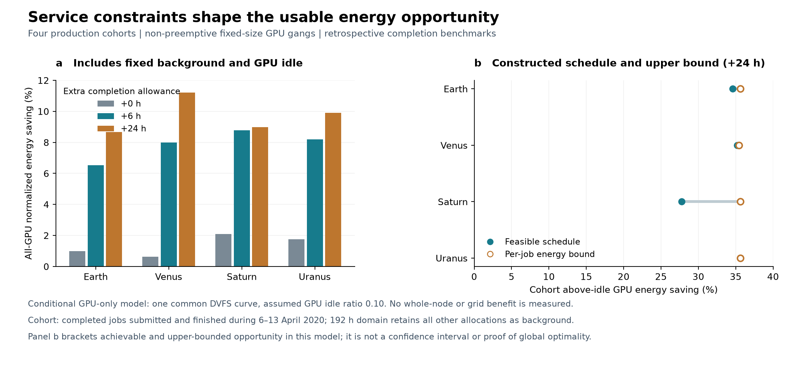

# 阶段 05：真实任务、固定 GPU 数量与不抢占整组回放

2026-09-22。本阶段从“发现旧任务生成不可行”推进到有明确服务证据的新回放：四个集群、三种预先指定的完成时间宽限，12 组均构造出不抢占的整组 GPU 排程，并逐任务和逐事件独立验证。尚未得到整机实测节能或电网收益，不能将本阶段百分比替换进原省级结果。

## 1. 输入与服务标准

统一选取容量日历中第一个完整的周一开始周，即 2020-04-06 至 04-13 之前。目标任务为该周内提交且已成功完成的 GPU 作业：Earth 774 个、Venus 2,332 个、Saturn 14,089 个、Uranus 11,521 个。任务集合在三个宽限分支完全相同，没有因求解状态或收益筛选任务。

所有其他 GPU 作业保持原始占用，包含未完成于该周的任务、跨期任务、失败/取消等状态，以及随后一天的新到达作业。各分支统一模拟 192 小时，因此较宽期限不会获得一个没有背景需求的空白尾部。

每个目标任务的工作代理为 `GPU 数 × 记录运行时间`，提交时刻固定。完成基准为“历史完成时刻 + 0/6/24h”，在求解前固定，不因不可行改变。该标准是事后回放参照，并非从轨迹取得的 SLA；工作代理也不是实测 token 数或有用训练进度。

新构造在一次连续区间内使用任务原来记录的整组 GPU 数量，不能拆成半个任务在多处执行、不能给单任务额外 GPU、不能抢占后恢复。仍是一个可互换 GPU 的聚合池，尚未验证具体节点、显存、互连或 GPU 型号的放置约束。

## 2. 条件结果：必须区分分母

本阶段把同一条 Dolly 微调 GPU 功率—吞吐曲线赋给全部目标任务，并假设 GPU 空闲功率为满速活跃功率的 10%。这是明确的同质化反事实，实际轨迹没有提供逐任务模型和功率曲线。没有推导整机 CPU、内存、风扇、制冷或站点能耗。

基线把已占用的 GPU 按该曲线的满速参考功率计入，其他已公布 GPU 按假设空闲功率计入；固定背景也使用这个占用功率假设。资源占用记录本身不能证明这些 GPU 当时都在满功率运行。

下表给出**计入全部固定背景和全部 GPU 空闲**后的归一化 GPU 能耗下降；单位不是电网成本，也不是整机节能率：

| 集群 | 不晚于历史完成时间 | 允许额外 6h | 允许额外 24h |
|---|---:|---:|---:|
| Earth | 1.00% | 6.54% | 8.66% |
| Venus | 0.63% | 7.98% | 11.21% |
| Saturn | 2.09% | 8.77% | 8.98% |
| Uranus | 1.75% | 8.20% | 9.90% |

“目标任务组高于空闲的能耗”是另一个较小分母。比如 Earth、0h 时，整组构造在这个分母下下降 3.98%，而全部 GPU 能耗仅下降 1.00%；分数型松弛的最优值为 4.54%，它不能当成已实现的整组排程。

没有额外宽限时仍可节能，是因为部分作业可在历史排队空档中提前启动，以较慢速度在原完成时间之前结束。不能因此推断用户愿意接受额外延迟，也不能推断现场调度器在未知未来任务时能实现同样效果。

## 3. 可行解与上界同时保留

整组构造从真实已发生的排程出发，其余尚未调整的任务一直保留原资源预约。每次只释放一个任务的原预约，在满足其 GPU 数、提交时刻和完成基准的连续空闲区间中选择能耗更低的运行模式。原预约始终是可行后备，因此构造不会通过删除任务来成功。具体结果再由独立事件扫描验证，而不只依赖这个构造论证。

另为每个任务计算忽略任务间资源竞争时的最小能耗。该值之和是联合能耗的下界，所以给出节能机会的上界；用枚举任意两种速度/空闲点的独立方法核对。它不是置信区间，不是已实现收益。

例如 24h 时 Saturn 的任务组节能构造值为 27.77%，单任务界为 35.60%，两者差距仍明显，不能宣称排程已经全局最优。该界可以指导后续优化，而不需要把未求解成功的最优模型当作负面样本删掉。

## 4. 求解状态与修复记录

分数型、可抢占的全局 LP 保留为松弛参照：12 个预设案例中 1 个达到最优、4 个在 120s 求解预算内未解决、7 个超过 500 万变量的本地规模门槛。后两类没有标成不可行，也没有从表中删除。

初次运行另有 5 例由于浮点小时转秒产生重复事件边界的程序错误，已在确认进程终止后改为统一秒坐标，并仅重跑这 5 例；原错误记录保留。整组构造的早期导出键冲突及一次极短伪重叠的验证失败也保留，统一秒坐标后最终 12 例全部通过。时间表以 1e−8 秒的表示精度保存，工作与时限由原始记录重新核对；没有扩大服务期限来掩盖误差。

这组全局 LP 尚未全部解决。整组可行构造与解析上界使研究仍能得到有效的范围证据，但不能冒充全局最优对照已经完成。

## 5. 验证覆盖

- 72 项分数型模型检查通过，包含 50 个独立离散穷举参照；特意保留一个“分数解可行、整组执行不可行”的反例，防止混淆两种可行性。
- 303 项整组构造和能耗界检查通过，包含 60 组随机可行基线的独立事件扫描与单任务 LP 对照。
- 12 个真实案例的所有任务逐项核对原始行、GPU 数、提交时刻、完成基准和工作代理；所有状态背景及跨期边界完整保留。
- 最大任务工作误差为 7.45e−11 GPU 小时；集群 GPU 超限为 0；提交/完成时间窗口违反为 0。
- LP 保存运行前代码与输入哈希；整组构造保存运行前代码/曲线哈希，并在案例输出记录轨迹/容量哈希，后者明确不是运行前采集。实际排程、原始运行状态及独立原始数据复核均保留；图从独立核验的结果表生成，已检查渲染。

结果：[整组排程汇总](replay/gang/certified_results.csv)、[独立核验](replay/gang/independent_verification.json)、[LP 状态表](replay/pilot_results.csv)、[失败及修复记录](replay/attempt_history.json)。

## 6. 尚需完成的工作

这是预先指定一周的试验，还需多周留出验证、其他功率曲线、资源拓扑和服务模式。目标任务按成功完成及周边界选择，覆盖范围必须一直报告，不能推广为全部 AI 作业。所用历史完成时刻和未来背景是完全已知的回放信息，部署机制还要采用公平的预测信息集。

下一步将冻结未参与这次开发的时间窗，扩展回放与四组政策比较；再把经服务验证的负荷轨迹接入已修正的电网模型。整机同步功率校准、2030 输入、水库水量、可调整煤电承诺与全年可靠性仍未完成。用户尚未提供额外功率或服务协议数据，公开数据范围内的独立工作继续推进。
