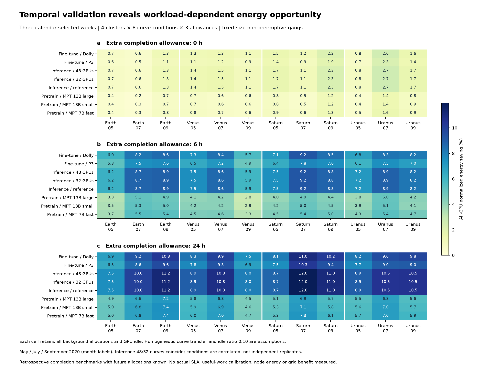

# 阶段 06：跨时间与功率曲线验证

2026-09-22。将阶段 05 的整组排程算法固定后，在预先指定的另外三个时间窗开展 288 组条件回放。所有预设案例均完成并通过独立逐任务、逐事件核验。这扩大了证据覆盖，仍不构成整机实测、实际 SLA、在线部署或全年电网收益证据。

## 1. 先固定规则，再计算结果

选择 2020 年 5、7、9 月的第一个周一：5 月 4 日、7 月 6 日、9 月 7 日。四个集群的每个时间窗均取 168 小时目标任务和 192 小时背景，分别使用全部 8 个既有功率曲线标签、0/6/24h 完成宽限，共 4×3×8×3=288 组。日期不按效果选择，也不按可行性替换。

规则、全部案例、运行前代码快照与原始轨迹/容量/曲线哈希保存在 `multiperiod/manifest.json` 和 `source_snapshot.json`，于结果计算前提交为 `6c6cd63`。排程核心算法没有因这些结果修改。所有失败均须保留；本轮实际出现 0 个运行错误、0 个核验失败。

这是针对冻结算法的时间扩展验证。原始轨迹此前已用于全期占用审计及早期研究，不能将这些日期称作整个研究从未接触过的外部测试集，也不能称为前瞻性部署试验。

## 2. 288 个条件不等于 288 次独立实验

实际包含 12 个集群—周任务集合、118,703 条不同的作业记录。每个集合在曲线和期限条件间完全相同，没有删掉耗能大或不利的任务。8 个曲线标签中，48 GPU 和 32 GPU 的推理配置在归一化后相同（12 位小数精度），其余曲线也来自相关实验条件。保留全部预设标签，但不把重复曲线当成独立支持证据。

每个条件仍假设所有目标任务使用同一条指定曲线、GPU 空闲功率比为 0.10。这不是实测混合业务：日志没有逐任务模型、硬件或有用进度校准。基线占用 GPU 的满速参考功率也是假设，不能从分配记录推出实际功率。

## 3. 条件收益与覆盖率

下表范围跨全部预设集群—周和曲线条件，包含固定背景及全部 GPU 空闲功率，表示归一化 GPU 能耗下降；不是整机节能率、置信区间或电网成本收益。

| 历史完成时间之外的宽限 | 最小值 | 最大值 |
|---|---:|---:|
| 0h | 0.25% | 2.70% |
| 6h | 2.81% | 9.25% |
| 24h | 4.55% | 11.96% |

在相同集群—周的配对条件中，放宽完成时间后构造收益没有下降。但这只描述本轮结果；嵌套的可行域保证最优值不变差，不保证任意贪心算法具有同样的单调性。未声明全局最优。构造收益与逐任务放松上界之间最大仍差 6.52 个百分点（目标任务高于空闲的能耗分母）。

可调整目标限定为该周提交且成功完成、GPU 数及运行时间为正的作业。其 GPU 小时只占整周全部占用的 **26.62%–40.59%**；其余分配全部保留为背景。因此，目标任务节能百分比不能直接推广为全体业务或全站节能。此覆盖率也不意味着其余任务永久不能调整，只说明本实验没有对其作出可调整性假定。

| 集群 | 5 月覆盖率 | 7 月覆盖率 | 9 月覆盖率 |
|---|---:|---:|---:|
| Earth | 26.62% | 33.73% | 38.43% |
| Venus | 31.55% | 36.52% | 28.48% |
| Saturn | 30.17% | 40.59% | 38.43% |
| Uranus | 29.99% | 35.88% | 36.97% |

图、范围和覆盖率都从独立核验后的表生成。图已查看渲染，三个面板使用同一色标，所有条件逐格显示。

## 4. 验证覆盖和证据边界

独立核验程序重新读取原始日志，按冻结规则重建每一组任务并核对原始行号；检查每个任务使用原 GPU 数、单个连续区间、完整工作代理和固定完成窗口。背景与新排程以事件增减量重新求和，没有复用排程程序的容量检查。能耗界采用所有两种模式/空闲点组合的枚举复核，没有复用构造器的凸包程序。

288 个条件均通过：最大工作代理残差为 **6.40e−10 GPU 小时**，聚合 GPU 超限为 **0**，提交/完成窗口违反为 **0**。12 个任务集合的任务数、工作量、背景占用分母和覆盖率在全部配对条件间一致。

本次算法没有改变，不重复运行阶段 05 的相同解析测试；新增验证针对新时段、全部曲线和全部真实作业，测试范围与新增主张对应。保留压缩后的逐任务排程、逐案摘要、运行日志、核验报告、全部结果和输入来源哈希。原始来源文件没有复制到研究输出目录。

证据入口：

- [全部核验结果](multiperiod/certified_results.csv)
- [任务覆盖率](multiperiod/cohort_coverage.csv)
- [各曲线条件范围](multiperiod/conditional_ranges.csv)
- [独立核验报告](multiperiod/independent_verification.json)
- [预设规则与运行前哈希](multiperiod/manifest.json)

## 5. 对论文的影响与下一步

可以增加的结论是：在固定期限参照和完整背景下，冻结的整组构造能跨三个指定时段生成可验证排程；条件能耗收益随完成宽限和功率曲线显著变化。不能增加“所有 AI 作业均可获得这一收益”“真实用户同意这些期限”或“这证明原省级收益稳健”等结论。

下一步先在同一真实任务、功率边界、信息条件下实现能效与时移四组政策对照，输出经验证的负荷轨迹后接入电网修订模型。还须补齐同硬件整机功率、实际服务约束、资源拓扑、全年可靠性、水库预算、煤电承诺和 2030 输入一致性。稿件主文、SI、表图和投稿信应在这些实质结果稳定后统一重写；本阶段不代表 Nature Energy 水平已全部达到。
