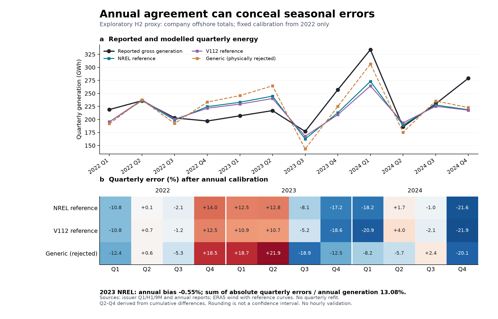

# 阶段 19：季度观测揭示年度误差抵消

2026-09-23。本轮把阶段 18 的年度检验推进到三年、12 个季度，未重新拟合任何参数。新增证据表明：即使年度发电量几乎吻合，也可能掩盖相当大的季节性偏差。此结果进一步否定以年度校准作为小时风电输入充分验证的做法，尚未解决真实小时出力或省级代表性。

## 观测与来源

取得江苏新能 2023、2024 年各自的第一季度、半年度和第三季度报告，共六份公司编制的原始 PDF；其中三份来自巨潮资讯，三份为新浪的公司报告原文镜像，并非财经新闻转述。逐文件 URL、获取时间、SHA256 见 `rudong_h2_quarterly/source_manifest.json`。

| 报告 | PDF 数据页 / 表头页 | 累计周期 | 来源 |
|---|---|---|---|
| 2023 Q1 | 5 / 4 | 2023、2022 年 1–3 月 | [公司报告镜像](https://file.finance.sina.com.cn/211.154.219.97%3A9494/MRGG/CNSESH_STOCK/2023/2023-4/2023-04-26/9079755.PDF) |
| 2023 H1 | 13 / 12 | 2023、2022 年上半年 | [巨潮资讯](https://static.cninfo.com.cn/finalpage/2023-08-29/1217673366.PDF) |
| 2023 Q3 | 4 / 4 | 2023、2022 年 1–9 月 | [公司报告镜像](https://file.finance.sina.com.cn/211.154.219.97%3A9494/MRGG/CNSESH_STOCK/2023/2023-10/2023-10-28/9603937.PDF) |
| 2024 Q1 | 4 / 4 | 2024、2023 年 1–3 月 | [巨潮资讯](https://static.cninfo.com.cn/finalpage/2024-04-25/1219790772.PDF) |
| 2024 H1 | 13 / 13 | 2024、2023 年上半年 | [公司报告镜像](https://file.finance.sina.com.cn/211.154.219.97%3A9494/MRGG/CNSESH_STOCK/2024/2024-8/2024-08-28/10420802.PDF) |
| 2024 Q3 | 5 / 5 | 2024、2023 年 1–9 月 | [巨潮资讯](https://static.cninfo.com.cn/finalpage/2024-10-30/1221554584.PDF) |

逐表人工阅读并检查六张渲染页，pypdf 与 pdftotext 分别核对四个电量字段及两个同比字段，共 48 次电量字段、24 次同比字段读取。2023 年 Q1、H1、9M 在下一年比较列重复披露；三组的发电量和上网电量在显示精度下全部一致，没有静默平均或择取较合适版本。

观测范围继续保持为公司控股海上风电，与 H2 的对应仍是文件支持的推断。第一季度直接使用累计数，第二、三季度分别由 H1−Q1、9M−H1 得到，第四季度由已完成来源核验的年度披露数减去 9M 得到。本研究的来源核验不改变季度财务报告原有未经财务审计的状态。该序列不是月度或逐小时场站计量。单个累计量半个末位为 500 MWh，两个累计量之差的保守显示范围为 ±1,000 MWh；相邻季度共享累计端点，不能视为独立观测误差或独立实验。

## 冻结与方法

季度诊断方案在聚合模型结果前以 `1eac401` 冻结，SHA256 为 `ce972c86eb621db2a3fd7afcef71dc003ba154e7ddf8b3720586a75aaa02467f`。此前已经见到全部年度结果及若干累计披露，因此明确是探索性诊断，不称盲测或预注册。

沿用阶段 18 的三个完整年度小时序列和 2022 年校准系数，不新增气象请求、不逐季校准、不裁剪、不择优选曲线。按本地小时所在自然季度聚合；三年季节长度和闰年保持真实日历。被拒绝的通用公式也保留，以展示失败，不能因其个别季度误差较小而恢复准入。

年度净误差定义为季度有符号误差之和；季度绝对误差指标为四个季度绝对误差之和除以年度观测发电量。误差抵消比例定义为 1−|年度净误差|/季度绝对误差之和，仅是描述性代数关系，不是统计置信度或模型通过率。

## 关键结果

2023 年参考 NREL 形状的年度误差只有 −0.551%，但各季度为：

| 季度 | 年报/季报推导实际发电量 MWh | 固定年度校准后的误差 |
|---|---:|---:|
| Q1 | 207,000 | +12.545% |
| Q2 | 217,000 | +12.792% |
| Q3 | 177,000 | −8.101% |
| Q4 | 257,000 | −17.167% |

四季度绝对误差合计 112,184.89 MWh，占全年实际发电量 13.075%；全年净误差仅 −4,728.59 MWh，约 95.785% 的绝对误差在年度合计中相互抵消。V112 同年也有类似现象：年度误差 −1.338%，季度绝对误差指标 11.973%，抵消比例 88.822%。这两条曲线均不能因年度误差小就称为准确的时序转换。

2024 年参考曲线的偏差主要体现在第一和第四季度：NREL 分别低估 18.248%、21.634%，V112 分别低估 20.862%、21.934%。这是残差分布，不足以把原因归为检修、限电、天气偏差或机型错误；需要实际设备、运行、风速和电量记录才能识别。

2022 年年度校准使净年度误差按构造为零，但季度绝对误差指标仍为 NREL 6.496%、V112 6.117%。因此连拟合年也存在明显的季节偏差，不能将训练期年度吻合当成独立验证。

图保留全部曲线与全部季度。PNG 已检查文字、数值、单位及布局；PDF/SVG 同步导出。此图用于修订诊断，不是已经准入的最终主文结果。所有 36 个季度条件详见 `quarterly_comparison.csv`，年度抵消关系见 `annual_cancellation.csv`。

## 验证、失败记录与剩余门槛

独立核验器从原始天气开始，以十进制标量分段公式重建三条曲线，不调用生产聚合函数。36 个季度条件、9 个年度误差抵消指标和 12 个观测差分全部核对；最大季度电量差为 7.48×10⁻¹¹ MWh。校准系数、累计差分、季度小时数、容量越界计数、源文件和结果哈希均核对。

PDF 检查初次因跨列表头/多行行名提取顺序失败：pdftotext 会把年份和月份分离，也会把“风力发电（海上）”的数值放在行名两行之间。经原页视觉检查后仅修改定位规则，全部原转录值保持不变。网络网页解码失败后从已识别的公司 PDF 链接正常取得原件，没有降低 TLS 安全或绕过访问限制。

这轮已经补齐季度季节性诊断，未取得月度或小时观测。下一版方法文字应明确增加“物理边界→年度→季节性→小时/极端时段→独立场址/年份”的验证要求，不能仅换一条参考曲线、再匹配均值。实际 H2 曲线、运行损失与同范围计量，以及其他省份/技术的对应验证仍开放。整体 Nature Energy 目标未完成。
